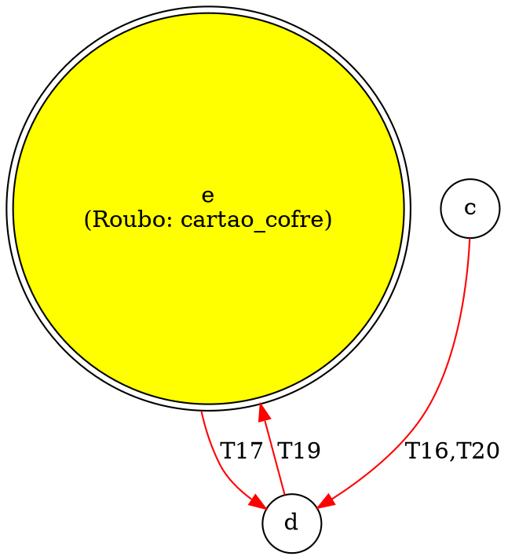

# CSI107 - Linguagens de Programação
**Departamento de Computação e Sistemas (DECSI) - UFOP**
**Professor:** Elton M. Cardoso — e-mail: eltonmc@ufop.edu.br

## Trabalho Prático

## 1. Objetivo do Trabalho

O objetivo deste trabalho prático é aplicar os conceitos de Programação Funcional na construção de um programa que faça o parsing de um arquivo de log gerado pelo jogo "Detetive x Ladrão", desenvolvido no TP1, e o converta em uma representação visual de grafos.

O programa deverá processar o histórico de ações dos agentes e exportar um arquivo no formato `.dot` (suportado pela ferramenta Graphviz), permitindo a visualização dos caminhos percorridos, ações de roubo e a topologia das cidades.

## 2. Descrição do Problema

Durante as partidas do jogo, o sistema imprime um log das ações turno a turno, para saída padrão. A saída pode ser direcionada para um arquivo e seu programa atuará como uma ferramenta de auditoria visual para analisar como a partida se desenrolou. Os seguintes requisitos de visualização devem ser cumpridos:

Ao gerar o arquivo `.dot`, o grafo resultante deve obrigatoriamente atender aos seguintes requisitos visuais:

- **Caminho do Ladrão:** As arestas (caminhos entre as cidades) por onde o ladrão passou devem ser destacadas em cor vermelha.
- **Caminho do Detetive:** As arestas por onde o detetive passou devem ser destacadas em cor azul.
- Se ambos passaram pela mesma aresta, o grafo resultante pode gerar arestas paralelas ou utilizar atributos visuais para denotar ambos.
- **Eventos de Roubo:** As cidades (nós do grafo) onde ocorreram eventos de roubo devem ser marcadas visualmente. Isso pode ser feito alterando a forma do nó (ex: `shape="doublecircle"`), sua cor de fundo, ou adicionando o item roubado ao rótulo (label) do nó.

## 3. Formato de Entrada

O arquivo de entrada será um texto puro contendo as ações ordenadas de forma cronológica, intercaladas com eventos globais e o estado final do jogo. A seguir apresentamos um exemplo de log de entrada:

```
20 ladrao: move(c,d) [OK]
20 detetive: nada [OK]
19 ladrao: move(d,e) [OK]
19 detetive: nada [OK]
>>>> Evento roubo(cartao_cofre, e, [altura(180)])
18 ladrao: roubar(cartao_cofre) [OK]
18 detetive: nada [OK]
17 ladrao: move(e,d) [OK]
17 detetive: fechar(d) [OK]
16 ladrao: move(d,c) [OK]

S = gSt(thief(loc(c),
          0,
          aparencia([altura(180), genero(gen1), corpulento,
                     cor_olhos(escuro), cor_cabelo(escuro),
                     ton_pele(...) | ...]),
          cx_joias, [], 3),
       detective(loc(a), nenhum, []),
       cx_joias, [], evt([],[]), livre, 20),
V = detetive.
```

## 4. Formato de Saída (Arquivo .dot)

O programa deve gerar como saída um arquivo em conformidade com a sintaxe DOT. A seguir apresentamos um exemplo de arquivo de estrutura esperada para a saída:



Pode-se gerar uma imagem em formato JPEG a partir desse arquivo por meio do comando DOT:

```
dot -Tjpeg ex1.dot -o ex1.jpeg
```

Alternativamente, pode-se utilizar a ferramenta **DOT Online Tool**.

## 5. Restrições e Paradigma Funcional

Sendo um trabalho de Programação Funcional, as seguintes restrições se aplicam de forma estrita à implementação:

- **Imutabilidade:** O estado não deve ser modificado (não utilize variáveis globais ou estruturas de dados mutáveis). Use recursão, passagem de parâmetros e acumuladores para manter o estado da conversão.
- **Funções Puras:** O núcleo da lógica de parsing e geração de strings do grafo deve ser composto por funções puras. O efeito colateral (I/O de leitura do log e escrita do arquivo `.dot`) deve ser isolado apenas nas funções principais/monádicas correspondentes do programa.
- **Funções de Alta Ordem:** Encoraja-se o uso de funções como `map`, `filter`, `fold`/`reduce` para o processamento das linhas do log e transformação dos dados.
- **Casamento de Padrões (Pattern Matching):** Utilize o recurso de casamento de padrões da linguagem para interpretar os comandos (ex: separar `move(X,Y)` de `roubar(Item)`).

## 6. O que deve ser entregue

- O código fonte do programa completo, documentado e estruturado.
- Um arquivo `README.md` explicando como compilar e executar o código, além de uma breve descrição da arquitetura funcional escolhida.
- Pelo menos 2 (dois) arquivos de log de teste (incluindo o fornecido neste enunciado) e as respectivas saídas em formato `.dot` geradas pelo seu programa.

> A entrega deverá ser feita exclusivamente pela plataforma Moodle até o dia **17/07/2026**. Entregas atrasadas serão penalizadas pela fórmula 2ⁿ.

## 7. Guia Rápido da Sintaxe DOT

A linguagem DOT é um formato de texto puro utilizado pelo Graphviz para descrever grafos. Para este trabalho, você precisará apenas de um subconjunto simples de comandos para gerar o grafo direcionado, nós (cidades) e arestas (caminhos).

Um arquivo `.dot` básico segue a seguinte estrutura. Todo o conteúdo deve estar encapsulado em um bloco `digraph` (grafo direcionado), pois as rotas possuem um sentido de origem e destino:

```dot
digraph Jogo {
    // nós e arestas vão aqui
}
```

Por padrão, o Graphviz cria um nó automaticamente quando ele é citado em uma aresta. No entanto, para customizar a aparência de uma cidade (por exemplo, marcar onde ocorreu um roubo), você deve declarar o nó explicitamente e adicionar atributos entre colchetes `[]`.

**Sintaxe base:** `nome_do_no [atributo="valor"];`

**Atributos úteis (nós):**
- `label`: O texto que aparecerá dentro do nó. O caractere `\n` pode ser usado para quebra de linha.
- `shape`: O formato do nó. Valores comuns são `circle` (padrão) e `doublecircle` (ideal para destacar eventos).
- `style="filled"` e `fillcolor`: Usados em conjunto para pintar o fundo do nó.

**Exemplo de nó com roubo:**

```dot
e [shape="doublecircle", style="filled", fillcolor="gold", label="e\nRoubo: cartao_cofre"];
```

As arestas conectam dois nós e representam a movimentação (o comando `move`) do ladrão ou do detetive de uma cidade para outra. Elas são definidas usando o operador `->`.

**Sintaxe base:** `origem -> destino [atributo="valor"];`

**Atributos úteis (arestas):**
- `color`: Define a cor da linha. Você deve usar cores diferentes para o detetive e o ladrão (ex: `"red"`, `"blue"`).
- `label`: Texto que flutua sobre a aresta. Ideal para mostrar o turno (ex: `"T19"`).

**Exemplos de arestas:**

```dot
c -> d [color="red", label="T20"];   // Movimento do Ladrão
a -> b [color="blue", label="T18"];  // Movimento do Detetive
```
